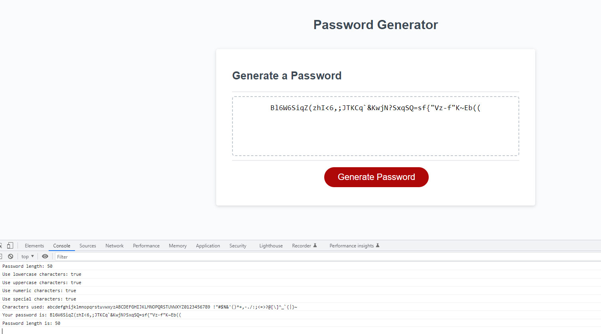

# Module3 Challenge: Password Generator

## Description

Write javascript code to create a password generator that creates a password between 8 and 128 characters using any combination of lowercase, uppercase, numeric and special characters. When the password is generated it is displayed on the webpage.

## Tasks accomplished

<ul>
    <li>Created user prompts for password length and character type used</li>
    <li>Ensured valid entries for password length and at least one character type is used</li>
    <li>Password will be generated based on the input given by the user</li>
</ul>

## Website Link

Link to deployed website is [Password Generator](https://larsonrj.github.io/password-generator/)

## Website Preview

